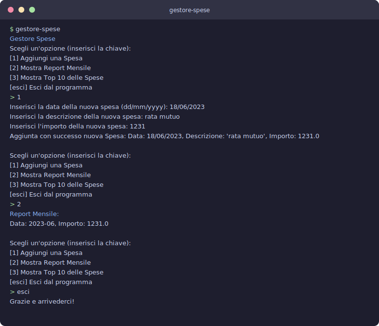

# Gestore delle Spese Domestiche

[](https://github.com/profession-ai-data-engineering-master/profession_ai_data_engineering_progetto1/actions/workflows/ci.yml)

[](https://codecov.io/gh/profession-ai-data-engineering-master/profession_ai_data_engineering_progetto1)

[](https://profession-ai-data-engineering-master.github.io/profession_ai_data_engineering_progetto1/)

Applicazione da riga di comando per tracciare le spese personali, generare un
report mensile e individuare le spese più rilevanti. I dati sono persistiti in
un semplice file CSV.

Il progetto nasce come esercizio di portfolio: oltre a soddisfare i requisiti
funzionali, è strutturato secondo i principi della **Clean Architecture** e del
**Domain-Driven Design**, con copertura di test, type checking statico e CI.

## Funzionalità

- **Aggiungi una spesa** — data, descrizione e importo, salvati su CSV.
- **Report mensile** — totale delle spese aggregato per anno/mese, in ordine di data decrescente.
- **Top 10 spese** — le dieci spese di importo maggiore.

## Esempio d'uso



<details>
<summary>Trascrizione testuale della sessione</summary>

```text
$ gestore-spese
Gestore Spese
Scegli un'opzione (inserisci la chiave):
[1] Aggiungi una Spesa
[2] Mostra Report Mensile
[3] Mostra Top 10 delle Spese
[esci] Esci dal programma
> 1
Inserisci la data della nuova spesa (dd/mm/yyyy): 01/05/2025
Inserisci la descrizione della nuova spesa: spesa di test
Inserisci l'importo della nuova spesa: 30.41
Aggiunta con successo nuova Spesa: Data: 01/05/2025, Descrizione: 'spesa di test', Importo: 30.41
...
> 2
Report Mensile:
Data: 2025-05, Importo: 830.41
```

</details>

## Requisiti

- Python **>= 3.10**
- Nessuna dipendenza di runtime esterna per il funzionamento di base (solo
  libreria standard). Il motore di reporting SQL è **opzionale** (extra
  `analytics`, basato su DuckDB) — vedi [Motore di reporting](#motore-di-reporting-in-memory-vs-sql).

## Installazione

```bash
# clona il repository, poi:
python -m venv .venv
source .venv/bin/activate        # Windows: .venv\Scripts\activate
pip install -e .
```

## Avvio

```bash
gestore-spese
```

In alternativa, senza installare il console script:

```bash
python -m gestore_spese.interfaces.cli.main
```

Le spese vengono salvate nel file `storico_spese.csv` nella cartella corrente.

## Architettura

Il codice è organizzato in quattro layer concentrici; le dipendenze puntano
sempre verso il dominio (Dependency Inversion tramite classi astratte):

```
interfaces/      CLI (pattern Command) + composition root
   │  dipende da
application/     casi d'uso (Aggiungi / ReportMensile / Top10) + DTO
   │  dipende da
domain/          entità (Spesa), contratti repository, servizi  ← cuore, nessuna dipendenza
   ▲  implementato da
infrastructure/  persistenza CSV (datasource + repository)
```

- **`domain`** — la `Spesa` con le sue regole di validazione, i contratti astratti di repository e servizio. Non dipende da nessun altro layer.
- **`application`** — i casi d'uso che orchestrano il dominio e il DTO del report mensile.
- **`infrastructure`** — l'implementazione concreta della persistenza su CSV, dietro le astrazioni del dominio.
- **`interfaces`** — la CLI: ogni operazione è un *Command* (pattern Command → aperto all'estensione, chiuso alla modifica) e `GestoreSpeseCli` fa da *composition root* cablando le dipendenze.
- **Reporting intercambiabile** — i report di sola lettura passano per la porta `AbstractReportingProvider`, con due implementazioni (Python in-memory di default, DuckDB/SQL opzionale) selezionabili a runtime. Vedi [Motore di reporting](#motore-di-reporting-in-memory-vs-sql).

Le scelte progettuali (DDD, SOLID, pattern adottati) sono descritte nelle
docstring dei moduli, consultabili nella [documentazione API](#documentazione).

## Struttura del progetto

```
src/gestore_spese/
├── domain/
│   ├── entities/          # AbstractSpesa, Spesa
│   ├── repositories/      # AbstractSpesaRepository
│   └── services/          # AbstractSpesaService, SpesaService
├── application/
│   ├── dtos/              # ReportMensileDto
│   ├── ports/             # AbstractReportingProvider (porta di reporting)
│   ├── reporting/         # InMemoryReportingProvider (motore in-memory, default)
│   └── use_cases/         # AbstractUseCase, AggiungiSpesa/ReportMensile/Top10
├── infrastructure/
│   ├── persistence/
│   │   ├── datasources/   # SpesaDataSourceCsv
│   │   └── repositories/  # SpesaRepository
│   └── reporting/         # DuckDbReportingProvider + factory di selezione motore
└── interfaces/
    └── cli/               # commands/, main.py (GestoreSpeseCli + entry point)
tests/                     # suite pytest, speculare a src/
docs/                      # traccia del progetto
```

## Motore di reporting (in-memory vs SQL)

I report di sola lettura (*Report Mensile* e *Top 10*) possono essere calcolati
con due motori intercambiabili dietro la stessa astrazione
(`AbstractReportingProvider`):

- **in-memory (default)** — l'aggregazione avviene in Python; nessuna dipendenza
  esterna;
- **DuckDB / SQL** — l'aggregazione viene *spinta* nel motore dati (*push-down*)
  ed espressa in SQL (`GROUP BY`/`SUM`, `ORDER BY`/`LIMIT`) leggendo
  direttamente il file CSV.

> ⚠️ **Onestà intellettuale.** Su un CSV di spese domestiche il volume è minimo:
> il motore SQL **non** porta vantaggi di performance (anzi, può essere
> marginalmente più lento per l'overhead del motore). Non è un'ottimizzazione: è
> una dimostrazione del *pattern* data-engineering del push-down e di come la
> *Dependency Inversion* permetta di scambiare il motore di calcolo senza toccare
> i layer superiori. L'output dei due motori è identico.

Per usare il motore SQL, installa l'extra e imposta la variabile d'ambiente:

```bash
pip install -e ".[analytics]"            # aggiunge duckdb
GESTORE_SPESE_ENGINE=duckdb gestore-spese
```

Senza l'extra (o con la variabile non impostata) si usa il motore in-memory. Se
richiedi `duckdb` ma l'extra non è installato, l'app avvisa e ricade
automaticamente sull'in-memory.

## Sviluppo

Installa le dipendenze di sviluppo ed esegui i controlli di qualità:

```bash
pip install -e ".[dev]"

ruff check .             # lint
ruff format --check .    # formattazione
mypy src                 # type checking statico (strict)
pytest                   # test + coverage (soglia 90%)
```

Gli stessi controlli girano in **CI** su GitHub Actions per Python 3.10, 3.11 e 3.12.

## Documentazione

La documentazione API è generata da Sphinx (dalle docstring reStructuredText) ed è
pubblicata su **GitHub Pages**:

🔗 https://profession-ai-data-engineering-master.github.io/profession_ai_data_engineering_progetto1/

Per generarla in locale:

```bash
pip install -e ".[dev]"
sphinx-build -b html docs docs/_build/html
# apri docs/_build/html/index.html
```

## Licenza

Distribuito con licenza [MIT](LICENSE).
